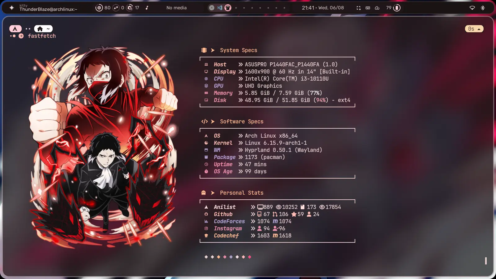
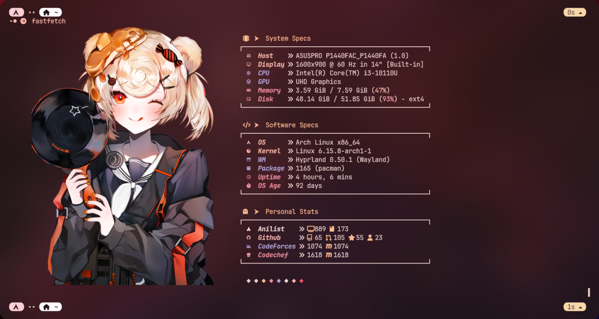
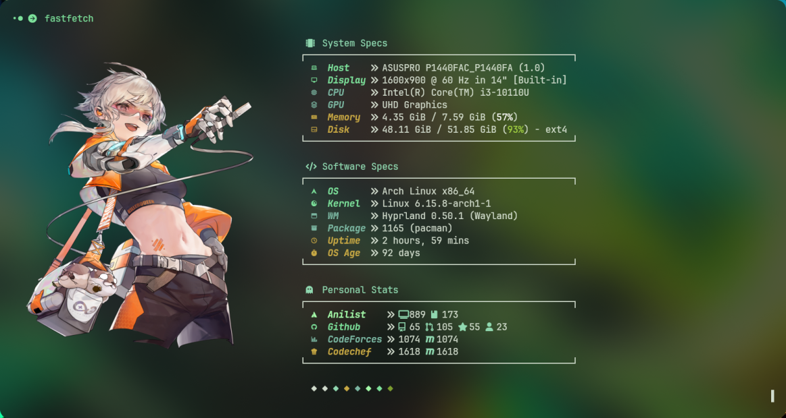
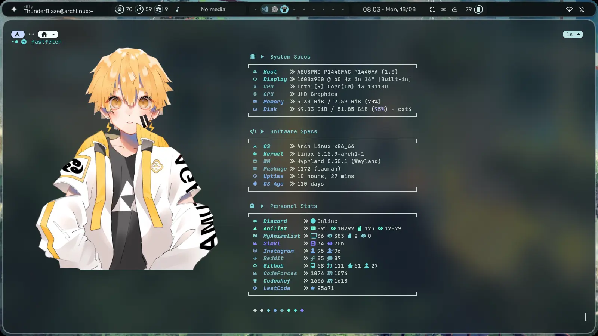

<div align="center">
  
# ⚡ Tsukiyomi Fetch

*A personalized Fastfetch configuration with dynamic online statistics*

[](https://opensource.org/licenses/MIT)
[](https://github.com/Thunder-Blaze/Tsukiyomi-Fetch/stargazers)
[](https://github.com/Thunder-Blaze/Tsukiyomi-Fetch/network/members)

Custom configuration and statistics script for [Fastfetch](https://github.com/fastfetch-cli/fastfetch), designed to display personalized system and online profile stats in a clean and minimal way with beautiful anime-themed visuals.



</div>

---

## What is Tsukiyomi Fetch?

Tsukiyomi Fetch transforms your terminal into a beautiful and informative dashboard that displays:

- **Visual Appeal**: 50+ high-quality anime images with clean, minimal layouts
- **Live Statistics**: Real-time stats from your favorite coding and social platforms
- **Performance**: Rust-powered backend with intelligent caching (1-day TTL)
- **Customization**: Easy configuration and modular design
- **Simplicity**: One-command installation and setup

## Features

- **Beautiful Interface**: Minimal and clean Fastfetch configuration with 50+ high-quality anime images
- **Multi-Platform Stats**: Dynamic statistics from 8+ platforms
- **Performance Optimized**: 
  - Rust-powered backend for blazing fast execution
  - Intelligent caching system (24-hour TTL)
  - Asynchronous API calls for minimal latency
- **Easy Setup**: 
  - One-command installation script
  - Automated configuration management
  - Cross-platform compatibility (Linux focus)
- **Modular Design**: 
  - Add/remove platforms easily
  - Customizable display formats
  - Extensible architecture

---

## Project Structure

```
Tsukiyomi-Fetch/
├── assets/                     # Preview images and documentation media
│   ├── Preview1.webp             # Red theme preview
│   ├── Preview2.webp             # Green theme preview
│   └── Preview3.webp             # Main preview image
├── fastfetch/                  # Core Fastfetch configuration
│   ├── pngs/                     # 50+ high-quality anime images
│   ├── config.jsonc              # Primary Fastfetch configuration
│   ├── config2.jsonc             # Alternative configuration
│   └── tsukiyomi-fetch           # Compiled Rust binary
├── tsukiyomi-fetch-rust/       # Rust implementation (current)
│   ├── Cargo.toml                # Rust dependencies and metadata
│   ├── Cargo.lock                # Locked dependency versions
│   └── src/                      # Source code
│       └── fetchers/               # Platform-specific API fetchers
│           ├── anilist.rs            # AniList API integration
│           ├── codechef.rs           # CodeChef statistics
│           ├── codeforces.rs         # Codeforces rating system
│           ├── discord.rs            # Discord online status
│           ├── instagram.rs          # Instagram follower data
│           ├── github.rs             # GitHub profile stats
│           ├── leetcode.rs           # LeetCode ranking
│           ├── myanimelist.rs        # MyAnimeList integration
│           ├── reddit.rs             # Reddit Karma
│           ├── simkl.rs              # Simkl watch time statistics
│           └── twitter.rs            # Twitter followers
│       ├──  config.rs              # Configuration file handler
│       ├── cache.rs                # Intelligent caching system
│       ├── http.rs                 # HTTP client and utilities
│       ├── error.rs                # Error handling and types
│       ├── wrapper.rs              # Output formatting utilities
│       └── main.rs                 # Application entry point
├── tsukiyomi-fetch-bash/       # Legacy Bash implementation (deprecated)
│   ├── fastfetch-scripts.sh      # Core statistics fetcher
│   └── fastfetch-wrapper.sh      # Bash wrapper utilities
├── installer.sh                # Automated installation script
├── uninstaller.sh              # Clean removal script
└── README.md                   # This comprehensive guide
```

### Key Components

| Component | Language | Status | Purpose |
|-----------|----------|--------|---------|
| **tsukiyomi-fetch** | Rust | Active | High-performance statistics fetcher with caching |
| **fastfetch config** | Plain Text | Active | Beautiful terminal display configuration |
| **Bash scripts** | Bash | Deprecated | Legacy implementation (not recommended) |

---

## 🚀 Quick Start

### Prerequisites
- ***`Fastfetch`***

Note - `Curl` and `jq` are required for older bash scripts, but the Rust implementation uses its own HTTP client.

### Installation

**Option 1: Automated Installation (Recommended)**

```bash
# Clone and install in one go
git clone https://github.com/Thunder-Blaze/Tsukiyomi-Fetch /tmp/fastfetch --depth 1
cd /tmp/fastfetch
chmod +x ./installer.sh
./installer.sh
```

**Option 2: Manual Installation**

```bash
# Clone the repository
git clone https://github.com/Thunder-Blaze/Tsukiyomi-Fetch /tmp/Tsukiyomi-Fetch --depth 1

# Copy configuration files
cp -r /tmp/Tsukiyomi-Fetch/fastfetch/* ~/.config/fastfetch/

# Make scripts executable
chmod +x ~/.config/fastfetch/tsukiyomi-fetch

# Setup the config file
~/.config/fastfetch/tsukiyomi-fetch --setup
```

### First Run

After installation, simply run:

```bash
fastfetch
```

---

## 🔧 Configuration & Usage

### Configuration File

The configuration is stored at `~/.config/fastfetch/tsukiyomi-fetch.conf` and is generated on running `--setup`:

```ini
GitHub=your.username
Instagram=your.username
Codeforces=your_handle
CodeChef=your_handle
LeetCode=your_username
AniList=YourUsername
MyAnimeList=YourUsername
Reddit=your_username
Simkl=1234567  # Your Simkl User ID (see more below)
Steam=1234567 # Your Steam ID (see more below)
Twitter=your_username
Discord=your_discord_id  # Your Discord ID (see more below)
```

Some platforms may require additional tokens or IDs, which can be set in the `.env` file which should be created at `~/.config/fastfetch/.env`.
```
ANILIST=your_anilist_token
TWITTER=your_twitter_bearer_token
STEAM=your_steam_api_key
```

#### 📝 Getting Your Simkl User ID
- Visit `https://simkl.com/profile`, the URL becomes `simkl.com/XXXXXXX/` where XXXXXXX is your user ID.

#### 📝 Getting Your Steam User ID
- Visit `https://store.steampowered.com/account/`, you'll see the numeric Steam ID below the heading `<username>'s Account`.

#### 📝 Getting Your Discord User ID and Making Discord Work
- Open your profile and you'll see a `Copy User ID` button, click that to copy your user ID, put it in --setup when asked.
- Join the following Server for Discord Online Status Support: [Discord Server](https://discord.gg/863bbH2YZ9)
- Change your status once for it to start tracking.

#### 📝 Getting Your Anilist Token (For Private Anulist Profiles)
- For Quick setup
  1. Visit `https://anilist.co/api/v2/oauth/authorize?client_id=29217&response_type=token`
  2. Click "Authorize" to get your token and paste it in .env file in "~/.config/fastfetch/.env"
- For Extra Privacy Lovers
  1. Go to [AniList settings](https://anilist.co/settings/developer).
  2. Click on "Create New Client".
  3. Use this URL as your client's "Redirect URL":
  ```
  https://anilist.co/api/v2/oauth/pin
  ```

  4. Click "Save"
  5. Then go to https://anilist.co/api/v2/oauth/authorize?client_id={clientID}&response_type=token, replace the `{clientID}` with the client ID you get. It will ask you to log in and then provide you with the token to use.
  6. Copy the generated token and use it in your `.env` file or environment variables.


### 🧠 Available Commands

The Rust-powered `tsukiyomi-fetch` script supports the following commands:

#### Wrapper Commands (Recommended)
These commands fetch and format common available stats for a platform:

```bash
~/.config/fastfetch/tsukiyomi-fetch wrapper github      # All GitHub stats

# Some Available Customizations to Wrappers are
~/.config/fastfetch/tsukiyomi-fetch wrapper github --color green (change icon color to green color corresponding to the green keycolor in fastfetch config)
~/.config/fastfetch/tsukiyomi-fetch wrapper github --icons a --icons b (change default icon glyphs [1st one becomes a, 2nd one becomes b])
```

#### Individual Stat Commands

<details>
  
| Command | Output | Description |
|---------|--------|-------------|
| `codeforces rating` | `1547` | Current Codeforces rating |
| `codeforces maxrating` | `1698` | Highest achieved rating |
| `codechef rating` | `1834` | Current CodeChef rating |
| `codechef maxrating` | `1902` | Peak CodeChef rating |
| `discord status` | `Online` | Current Discord status |
| `leetcode rating` | `1654` | Current LeetCode rating |
| `leetcode rank` | `54231` | Global LeetCode ranking |
| `github repos` | `42` | Public repository count |
| `github followers` | `156` | GitHub followers |
| `github following` | `87` | Users you're following |
| `github prs` | `234` | Total pull requests |
| `github stars` | `1247` | Stars across all repos |
| `github forks` | `89` | Total repository forks |
| `anilist anime_count` | `387` | Anime entries watched |
| `anilist episodes` | `4823` | Total episodes viewed |
| `anilist manga_count` | `156` | Manga entries read |
| `anilist chapters` | `2847` | Total chapters read |
| `simkl totalhours` | `1247` | Total watch time (hours) |
| `simkl anime completed` | `234` | Completed anime count |
| `simkl anime hours` | `567` | Anime watch hours |
| `myanimelist anime_count` | `298` | MAL anime entries |
| `myanimelist anime_episodes` | `3456` | MAL episodes watched |
| `instagram followers` | `2847` | Instagram followers |
| `instagram following` | `456` | Instagram following |
| `reddit link_karma` | `100` | Link Karma earned |
| `reddit comment_karma` | `298` | Comment Karma Earned |
| `twitter followers` | `323` | Twitter followers |

</details>

### 🚀 Usage Examples

```bash
# Display GitHub repository count in your Fastfetch config
~/.config/fastfetch/tsukiyomi-fetch github repos

# Show current Codeforces rating
~/.config/fastfetch/tsukiyomi-fetch codeforces rating

# Get all AniList statistics at once
~/.config/fastfetch/tsukiyomi-fetch wrapper anilist
```

### ⚡ Performance & Caching

- **Cache Location**: `~/.cache/fastfetch/tsukiyomi.cache`
- **Cache Duration**: 24 hours (86,400 seconds)
- **Auto-Invalidation**: Cache refreshes when TTL expires or usernames change
- **Performance**: Rust implementation provides near-instantaneous responses for cached data

---

## 🖼️ Gallery

<div align="center">

### Preview Gallery

<table>
  <tr>
    <td align="center">
      
    </td>
    <td align="center">
      
    </td>
  </tr>
</table>

### Main Preview


</div>

---

## 🛠️ Troubleshooting

<details>
<summary> Common Issues & Solutions</summary>

### Script Not Executable
```bash
chmod +x ~/.config/fastfetch/tsukiyomi-fetch
```

### Cache Issues
```bash
# Clear cache manually
rm -rf ~/.cache/fastfetch/tsukiyomi.cache
```

### API Rate Limiting
- The 24-hour cache prevents hitting API rate limits
- If you encounter issues, wait for cache to expire or clear it manually

### Configuration Not Loading
- Ensure `~/.config/fastfetch/fastfetch_scripts.conf` exists
- Check file permissions: `chmod 644 ~/.config/fastfetch/fastfetch_scripts.conf`
- Verify username formats match platform requirements

</details>

---

## 🚀 Advanced Usage

### Custom Fastfetch Integration

Add the following to your `~/.config/fastfetch/config.jsonc`:

```jsonc
{
  "modules": [
    // ...existing modules...
    {
      "type": "custom",
      "key": "GitHub Repos",
      "command": "~/.config/fastfetch/tsukiyomi-fetch github repos"
    },
    {
      "type": "custom", 
      "key": "Codeforces",
      "command": "~/.config/fastfetch/tsukiyomi-fetch codeforces rating"
    }
    // Add more as needed...
  ]
}
```

### Building from Source

```bash
# Clone the repository
git clone https://github.com/Thunder-Blaze/Tsukiyomi-Fetch --depth 1
cd Tsukiyomi-Fetch/tsukiyomi-fetch-rust

# Build the Rust binary
cargo build --release

# Copy to Fastfetch directory
cp target/release/tsukiyomi-fetch ~/.config/fastfetch/
```

---

## 🤝 Contributing

We welcome contributions! Here's how you can help:

### 🎯 Areas for Contribution

- **New Platform Integrations**: Add support for more APIs (Discord, Steam, etc.)
- **Visual Improvements**: Create new themes and image collections
- **Bug Fixes**: Report and fix issues
- **Documentation**: Improve guides and examples
- **Performance**: Optimize caching and API calls

### 📝 Development Setup

```bash
# Fork the repository on GitHub
git clone https://github.com/YOUR-USERNAME/Tsukiyomi-Fetch
cd Tsukiyomi-Fetch

# Create a feature branch
git checkout -b feature/new-platform-support

# Make your changes
# ...

# Test your changes
cargo test  # For Rust changes
./installer.sh  # Test installation

# Commit and push
git add .
git commit -m "Add support for XYZ platform"
git push origin feature/new-platform-support

# Create a Pull Request on GitHub
```

---

## 🌟 Support

If you find this project helpful, please consider:

- **Star this repository** to show your support
- **Report bugs** via GitHub Issues  
- **Suggest features** for future development
- **Contribute** to the codebase
- **Share** with the community

Special thanks to:
- [**Zero**](https://github.com/GraveEaterMadison) - Instagram, Reddit, Twitter fetcher implementation
- [**Insane**](https://github.com/In-Saiyan) - CodeChef fetcher implementation

<div align="center">

---

**Made with ❤️ by [Thunder-Blaze](https://github.com/Thunder-Blaze)**

*Transform your terminal into a beautiful, informative dashboard*

</div>
